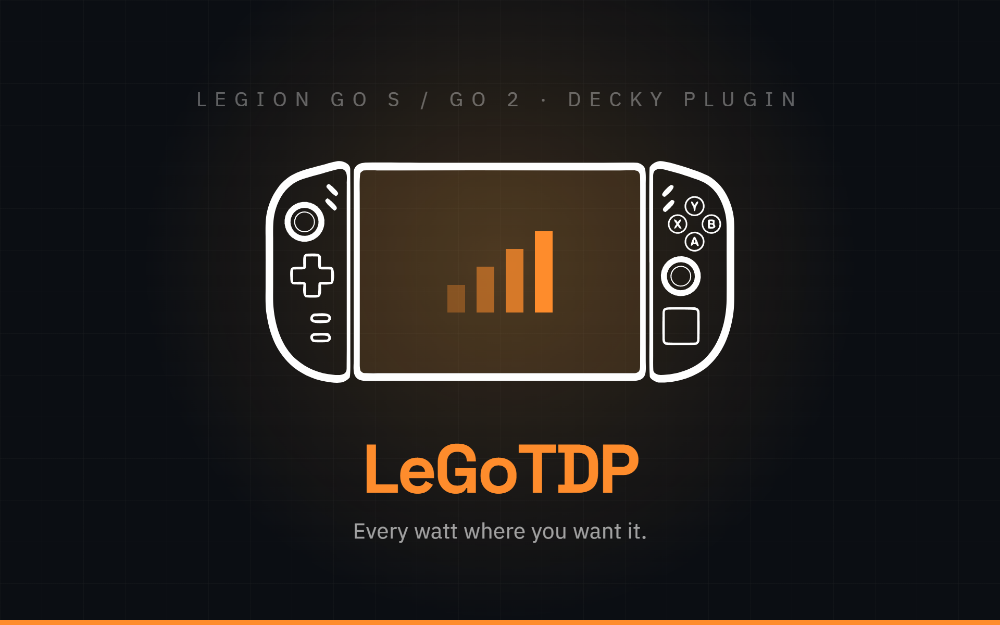

<div align="center">



[](https://github.com/Rayekkk/LeGoTDP/releases/latest)
[](https://github.com/Rayekkk/LeGoTDP/releases)
[](#requirements)
[](https://decky.xyz)
[](LICENSE)

**Set AMD CPU TDP limits from the Steam overlay.**
Presets tuned per machine, per-game profiles, and live power draw - without leaving Gaming Mode.

[Features](#features) · [Presets](#presets) · [Requirements](#requirements) · [Installation](#installation) · [Usage](#usage) · [How it works](#how-it-works) · [Troubleshooting](#troubleshooting)

</div>

<!-- Screenshots go here once they exist. Two columns keeps a 16:10 capture
     from swallowing the page - it renders at half width, so half the height.

| | |
|---|---|
|  |  |
-->

---

## Features

| | |
|---|---|
| **Presets** | Minimum / Silent / Balanced / Performance / Max with one tap |
| **Custom mode** | SPL is the main TDP dial; SPPT and FPPT are set as headroom *above* it |
| **Firmware-first** | Limits written through the Lenovo WMI interface, falling back to `ryzenadj` only for the extended range |
| **Per-game profiles** | Applied in the background when a game launches, no need to open the plugin menu |
| **Separate AC profile** | Independent limits for battery and charging, switched automatically when AC state changes |
| **Live TDP panel** | Current limits plus real-time package draw read from RAPL |
| **Drift enforcement** | Re-applies your settings every 5 s if the system overrides them, and stands down on targets the hardware refuses |
| **Enable/disable** | Hands the platform profile back to the firmware when turned off |
| **Charger-aware** | Limits re-asserted over the seconds after the charger goes in, because the firmware applies a profile of its own on that transition |
| **Extended range** | Legion Go 2 only - Extras unlocks the Custom sliders up to 50 W |

---

## Presets

Each machine gets its own ladder, spaced against the ceilings its firmware reports, so
**Max** asks for exactly what that hardware accepts.

### Legion Go 2

| Preset | SPL | SPPT | FPPT |
|---|---|---|---|
| Minimum | 5 W | +0 (5 W) | +5 (10 W) |
| Silent | 8 W | +2 (10 W) | +7 (15 W) |
| Balanced | 15 W | +3 (18 W) | +10 (25 W) |
| Performance | 25 W | +3 (28 W) | +10 (35 W) |
| **Max** | **35 W** | +2 (37 W) | +10 (45 W) |

### Legion Go S

| Preset | SPL | SPPT | FPPT |
|---|---|---|---|
| Minimum | 5 W | +3 (8 W) | +5 (10 W) |
| Silent | 8 W | +2 (10 W) | +7 (15 W) |
| Balanced | 18 W | +2 (20 W) | +7 (25 W) |
| Performance | 33 W | +0 (33 W) | +2 (35 W) |
| **Max** | **40 W** | +3 (43 W) | +13 (53 W) |

---

## Requirements

| Requirement | Details |
|---|---|
| Device | Lenovo Legion Go 2, or Legion Go S (Ryzen Z1 Extreme) |
| Firmware interface | `lenovo-wmi-other` under `/sys/class/firmware-attributes/` |
| Plugin loader | [Decky Loader](https://decky.xyz) |

> [!NOTE]
> On the Legion Go 2 the extended TDP range additionally needs `ryzenadj`, which the
> plugin downloads on first run. Everything else works through the firmware alone.

### Hardware

The sliders stop where the firmware says they do. Those limits are read from the hardware
at startup rather than assumed, so each machine gets its own:

| | SPL | SPPT | FPPT | Extras |
|---|---|---|---|---|
| **Legion Go 2** (Ryzen Z2 Extreme) | 5-35 W, then up to 50 W via `ryzenadj` | 5-37 W | 5-45 W | yes |
| **Legion Go S** (Ryzen Z1 Extreme) | 5-40 W | 5-43 W | 5-53 W | no |

Measured on both machines. The Go S reports the higher firmware ceilings of the two, which
is not what the names suggest.

On the Go S the firmware range is the whole range that is wanted, so `ryzenadj` is never
downloaded and the **Extras** section is not shown. Two things follow from that. The Go 2
cross-checks its limits against a live `ryzenadj` reading twice a minute, which catches an
override that bypasses the firmware interface; that check cannot run here. Drift is still
corrected, but only against what the firmware attributes themselves report.

> [!IMPORTANT]
> **Other Legion Go S variants, including the Ryzen Z2 Go, are untested.** They take the
> same firmware-only path, which is the conservative one: the firmware alone, with limits
> read from that machine rather than assumed from the Z1 Extreme. A variant with lower
> ceilings will have its presets clamped down to them, so the top of the ladder may not
> line up with the **Max** label.

---

## Installation

**1.** Install [Decky Loader](https://decky.xyz) if you haven't already.
**2.** Download `LeGoTDP-x.x.x.zip` from the [Releases](../../releases) page.
**3.** In Gaming Mode, open the **Quick Access Menu** (the `…` button).
**4.** Open the Decky menu, scroll to the bottom, then **Developer → Install Plugin from ZIP**.
**5.** Select the downloaded zip.

The zip contains a single `LeGoTDP` folder - Decky installs it automatically. Since 1.5.0
your settings and per-game profiles live in Decky's settings directory, so reinstalling
keeps them.

<details>
<summary><b>Building from source</b></summary>

<br>

Requires Node.js 18+.

```bash
git clone https://github.com/Rayekkk/LeGoTDP
cd LeGoTDP

npm install
npm run build      # bundles src/index.tsx into dist/
npm run package    # produces LeGoTDP-<version>.zip
```

Then install the resulting zip through Decky's **Install Plugin from ZIP**, which is the
supported path and avoids permission problems.

To copy the files directly instead, install only the runtime payload - copying the whole
checkout would drag in `.git/`, `src/` and `node_modules/`:

```bash
DEST=~/homebrew/plugins/LeGoTDP
sudo mkdir -p "$DEST"
sudo cp -r main.py lego_updater.py plugin.json package.json README.md LICENSE NOTICE dist "$DEST"
sudo systemctl restart plugin_loader
```

</details>

---

## Usage

Open the **Quick Access Menu** and tap the chip icon.

**Enable** - the master switch. Turning it off hands the platform profile back to the
firmware and stops the enforce loop, so the device behaves as if the plugin were not
installed.

**Presets** - Minimum, Silent, Balanced, Performance and Max apply immediately. The active
one is marked with `>`. Picking **Custom** reveals the sliders.

**Custom sliders** - SPL is the main dial, with SPPT and FPPT riding above it as offsets;
see [TDP parameters](#tdp-parameters) for what each one does. Press **Apply TDP** to commit.

**Per Game Profile** - launch a game, then turn this on. Whatever you pick from that point
on is stored against that game and applied automatically every time it runs, in the
background, with the plugin menu closed. Turn the toggle off to delete the profile and fall
back to the global settings.

**Separate AC Profile** - with a per-game profile on, this splits it into independent
battery and charging limits. The buttons switch which one the sliders are editing, and the
plugin swaps between them the moment the charger goes in or out.

**Current TDP** - live limits plus package draw read from the RAPL energy counter. It only
refreshes while the panel is on screen.

### Extras - Legion Go 2 only

> [!WARNING]
> Unlocks the Custom sliders up to 50 W, applied through `ryzenadj` instead of the
> firmware. **This overrides the manufacturer's safety limits - use at your own risk.**

One caveat on this path: SPPT and FPPT read back exactly, but SPL does not. On Strix Point
the `STAPM LIMIT` register that `ryzenadj --info` reports follows the fast limit rather than
the value passed to `--stapm-limit`, and the SMU keeps nudging it while it manages the
budget - so it is not a usable read-back. The panel therefore shows the SPL the plugin
applied rather than a number the hardware will not report. Below the firmware ceiling none
of this applies: limits go through WMI and all three read back exact.

---

## TDP parameters

SPL is an absolute value. SPPT and FPPT are set as an offset above SPL, so raising the TDP
carries the burst limits with it and the ordering `SPL <= SPPT <= FPPT` always holds.

| Parameter | WMI attribute | ryzenadj flag | Description |
|---|---|---|---|
| **SPL** | `ppt_pl1_spl` | `--stapm-limit` | Sustained Power Limit, the thermal steady-state target |
| **SPPT** | `ppt_pl2_sppt` | `--slow-limit` | Slow Package Power Tracking, sustained hard ceiling. Offset of +0 to +10 W above SPL |
| **FPPT** | `ppt_pl3_fppt` | `--fast-limit` | Fast Package Power Tracking, burst ceiling. Offset of +0 to +15 W above SPL |

Both offsets shrink automatically as SPL approaches the ceiling, so no combination can
exceed it. At the top of the range both collapse to +0. What that ceiling is on each
machine is in [Hardware](#hardware).

---

## How it works

Limits are applied through whichever layer can satisfy them:

- **Lenovo WMI** (preferred) - writes `ppt_pl*` under `/sys/class/firmware-attributes/`,
  which requires the platform profile to be `custom`. The firmware owns the value, so it is
  not fought back and survives suspend.
- **ryzenadj** (fallback) - used only when the request exceeds what the firmware accepts,
  i.e. the Extras range. Writes straight to the AMD SMU via PCIe MMIO.

The two layers do not observe each other: after a `ryzenadj` write the WMI attributes still
report the firmware's own bookkeeping, so the plugin reads back limits from whichever layer
last applied them.

Live package draw comes from the RAPL energy counter under `/sys/class/powercap/`, so the
panel does not need to spawn a process to refresh.

The Python backend runs an enforce loop every 5 seconds that:

1. Resolves the running Steam game. The frontend reports it from Steam's own Router, which
   is authoritative; the backend falls back to scanning `/proc` for the Steam reaper's
   `AppId=` argument when that value goes stale.
2. Applies a saved per-game profile automatically when a game launches.
3. Restores global settings when a game exits.
4. Re-applies settings if the system has overridden them (drift correction), giving up
   after a few attempts on targets the hardware silently refuses.
5. Re-asserts the limits over the seconds following a charger transition. The firmware
   applies a profile of its own when the charger goes in and it lands after ours, so a
   single write at the moment the state changes is overwritten.

Settings and per-game profiles are persisted through Decky's `SettingsManager`, so they
survive reinstalling the plugin.

`ryzenadj` is fetched automatically from [FlyGoat/RyzenAdj](https://github.com/FlyGoat/RyzenAdj)
GitHub releases on the first run, over https from a fixed allowlist of GitHub hosts. If that
fails and WMI is available, the plugin still works with the standard range.

---

## Troubleshooting

<details>
<summary><b>Sliders move but the limits do not change</b></summary>

<br>

```bash
# Is the firmware interface there at all?
ls /sys/class/firmware-attributes/lenovo-wmi-other-0/attributes/

# The firmware only accepts ppt_* writes while this reads 'custom'
cat /sys/class/platform-profile/*/profile

# Plugin logs
journalctl -u plugin_loader | grep legotdp | tail -30
```

If the platform profile keeps leaving `custom`, something else on the system is setting it -
the plugin logs `platform profile left 'custom', re-asserting limits` and takes it back.

</details>

<details>
<summary><b>The log says a target is unreachable</b></summary>

<br>

```
target (35.0, 50.0, 50.0) unreachable after 3 attempts, accepting (...) and standing down
```

Expected. Some limits are capped by the SMU regardless of what is requested, so the plugin
accepts whatever the hardware settled on rather than re-applying forever.

</details>

<details>
<summary><b>The Extras range does nothing</b></summary>

<br>

```bash
# Did the binary download?
ls -l ~/homebrew/plugins/LeGoTDP/bin/ryzenadj

# Does it run?
sudo ~/homebrew/plugins/LeGoTDP/bin/ryzenadj --info
```

</details>

---

## Development

```bash
npm run build       # bundle the frontend into dist/
npm run watch       # rebuild on change
npm run typecheck   # TypeScript check with no emit
npm run package     # build the release zip

python -m unittest discover -s tests -v   # backend tests, see tests/README.md
```

The frontend is built with [`@decky/rollup`](https://www.npmjs.com/package/@decky/rollup),
the official Decky preset, which maps `react`, `react/jsx-runtime`, `react-dom` and
`@decky/ui` onto the globals Steam injects rather than bundling them.

`lego_updater.py` is shared verbatim with all my other plugins -
change it in one repo and copy it to the other.

CI builds every push and pull request. Pushing a tag such as `1.5.0` builds the zip and
publishes a GitHub release; the tag must match the `version` in both `plugin.json` and
`package.json`.

---

## Credits

- [RyzenAdj](https://github.com/FlyGoat/RyzenAdj) by Jiaxun Yang and contributors, LGPL-3.0 - downloaded at runtime, not bundled; see [NOTICE](NOTICE)

---

## License

BSD 3-Clause - see [LICENSE](LICENSE). Third-party components are listed in [NOTICE](NOTICE).

---

<div align="left">

*Vibe coded with the help of [Claude](https://claude.ai) 🤖*

</div>
